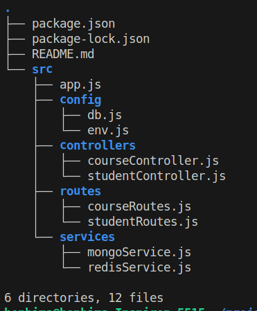
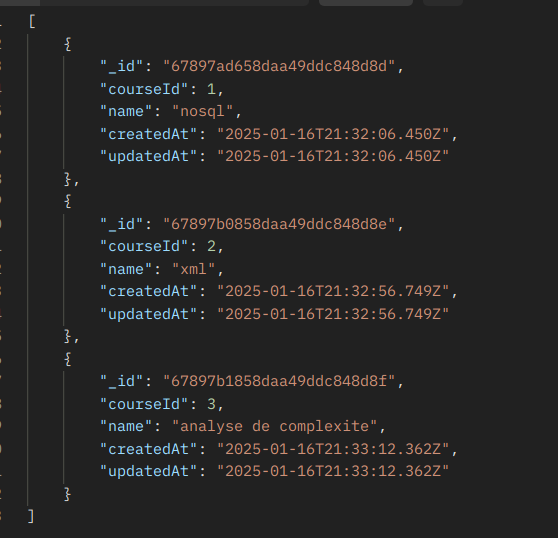

# Projet de fin de module NoSQL

Création d'une API avec Express, MongoDB et Redis pour effectuer des opérations CRUD.

## Comment configurer le projet dans votre environnement local ?

1. Configuration de votre environnement local :

   ```bash
   # Clonez mon dépôt template (ce dépôt)
   git clone https://github.com/BENHIMA-Mohamed-Amine/learning-platform-template.git

   # Renommez le dépôt origin
   cd learning-platform-template
   git remote remove origin

   # Ajoutez votre dépôt comme nouvelle origine
   git remote add origin https://github.com/[votre-compte]/learning-platform-nosql

   # Poussez le code vers votre dépôt
   git push -u origin main
   ```

2. Installation des dépendances :

   ```bash
   npm install
   ```

3. Démarrer le projet :

   ```bash
   npm run start
   ```

## Structure de projet:



- Le dossier `src` contient tout le code de mon projet.
- `app.js` sert à démarrer mon API.
- Le dossier `config` contient les fichiers de configuration pour la connexion à MongoDB et Redis, ainsi que le fichier `.env` (qui contient des informations sensibles sur la base de données : MongoDB et Redis).
- Le dossier `controllers` contient les fichiers de contrôleurs qui gèrent la logique des entités `course` et `student`.
- Le dossier `routes` définit les routes pour `course` et `student`.
- Le dossier `services` est responsable de la communication avec la base de données : insertion, mise à jour, suppression, affichage et gestion du cache.

## Choix Techniques

- Node.js et Express: Pour la création d'un serveur backend performant et flexible
- MongoDB: Pour la gestion des données
- Redis: Pour la gestion de caching
- Postman: Pour tester les endpoints

## Questions et Réponses :

### Question: Quelles sont les informations sensibles à ne jamais commiter ?

**Réponse** : Les informations sensibles à ne jamais commiter incluent les mots de passe, les clés API, les informations de connexion aux bases de données et toute autre donnée confidentielle.

### Question: Pourquoi utiliser des variables d'environnement ?

**Réponse** : Les variables d'environnement permettent de séparer la configuration du code, de simplifier le déploiement sur différents environnements et de sécuriser les informations sensibles.

### Question : Pourquoi créer un module séparé pour les connexions aux bases de données ?

**Réponse** : Un module séparé pour les connexions aux bases de données centralise le code de connexion, facilite la réutilisation, améliore la lisibilité du code et assure une gestion cohérente et efficace des connexions dans l'application.

### Question : Comment gérer proprement la fermeture des connexions ?

**Réponse** : La fermeture des connexions doit être gérée en écoutant les événements de terminaison de l'application (comme SIGTERM) et en fermant les connexions aux bases de données dans les gestionnaires associés. Cela garantit que les ressources sont correctement libérées.

### Question: Pourquoi est-il important de valider les variables d'environnement au démarrage ?

**Réponse** : La validation des variables d'environnement au démarrage permet de s'assurer que toutes les configurations nécessaires sont présentes et valides, évitant ainsi des erreurs imprévues et des comportements erratiques en production.

### Question: Que se passe-t-il si une variable requise est manquante ?

**Réponse** : L'absence d'une variable requise peut entraîner des erreurs graves, des pannes ou un fonctionnement incorrect de l'application. Il est donc essentiel de valider toutes les variables nécessaires avant de démarrer l'application.

### Question: Pourquoi créer des services séparés ?

**Réponse** : Créer des services séparés permet de découpler les composants de l'architecture, facilitant l'évolution de chaque service indépendamment, réduisant l'impact des pannes et améliorant la scalabilité en optimisant l'utilisation des ressources.

### Question : Comment gérer efficacement le cache avec Redis ?

**Réponse** : Pour une gestion efficace du cache avec Redis, utilisez des TTL (Time To Live) pour expirer les données obsolètes et éviter une surcharge mémoire. Adoptez également des clés structurées pour une gestion plus simple et une récupération rapide des données.

### Question: Quelles sont les bonnes pratiques pour les clés Redis ?

**Réponse** : Utilisez des noms de clés clairs et structurés, comme "object:id:field", pour simplifier leur gestion et recherche. Évitez les clés trop longues et assurez-vous qu'elles sont uniques pour prévenir les collisions.

### Question: Quelle est la différence entre un contrôleur et une route ?

**Réponse** : Une route définit un point d'entrée de l'application via une URL, tandis qu'un contrôleur gère la logique associée à cette action. Les routes orchestrent les points d'accès, et les contrôleurs traitent les requêtes et génèrent les réponses.

### Question : Pourquoi séparer la logique métier des routes ?

**Réponse** : Séparer la logique métier des routes rend le code plus modulaire, testable et maintenable. Cela permet également de réutiliser la logique métier dans différentes parties de l'application et de respecter le principe de responsabilité unique.

### Question: Pourquoi séparer les routes dans différents fichiers ?

**Réponse** : Séparer les routes dans différents fichiers améliore l'organisation, la lisibilité et la maintenance du code. Cela permet de regrouper les routes liées à des fonctionnalités spécifiques dans des fichiers distincts.

### Question : Comment organiser les routes de manière cohérente ?

**Réponse** : Organisez les routes par fonctionnalité ou ressource, en plaçant par exemple toutes les routes liées aux cours dans un fichier `courseRoutes.js` et celles liées aux utilisateurs dans `studentRoutes.js`. Utilisez une convention de nommage cohérente et documentez les routes pour faciliter la compréhension et la maintenance du code.

### Question: Comment organiser le point d'entrée de l'application ?

**Réponse** : Organisez le point d'entrée de l'application en définissant un fichier principal (comme `app.js`) qui initialise l'application, configure les routes, les middlewares et les connexions aux bases de données, et démarre le serveur. Ce fichier peut aussi gérer l'arrêt de l'application en écoutant les signaux de terminaison.

### Question: Quelle est la meilleure façon de gérer le démarrage de l'application ?

**Réponse** : La meilleure méthode consiste à décomposer le processus de démarrage en fonctions modulaires, puis à les exécuter séquentiellement dans le fichier principal (par exemple, `app.js`). Cela améliore la lisibilité et la maintenabilité du code. Il est également crucial de gérer les erreurs correctement et de suivre les bonnes pratiques pour les connexions aux bases de données.

## Captures d'écran

Voici une capture d'écran montrant la fonctionnalité pour récupérer les cours. Il est possible d'ajouter, de modifier et de supprimer des cours. De même, toutes les opérations CRUD sont disponibles pour les étudiants.  

